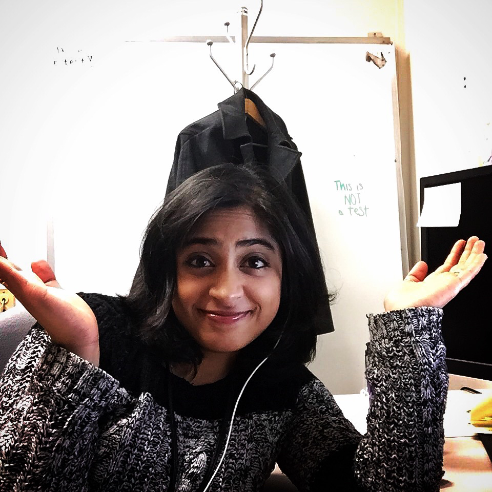

<section class="text-center">
  

    

      

        
        
        
        <h1>Aditi Rajagopal</h1>
        

          Engineer ◦
          Inventor ◦
          Artist
        

        

            <a href="https://github.com/jaxx2104"><i class="fa fa-github wow bounceIn" data-wow-duration="2.0s"></i></a>
            <a href="https://twitter.com/jaxx2104"><i class="fa fa fa-twitter wow bounceIn" data-wow-duration="2.0s"></i></a>
            <a href="http://jaxx2104.tumblr.com/"><i class="fa fa fa-linkedin wow bounceIn" data-wow-duration="2.0s"></i></a>
        

      

    

  

</section>
<section style="text-align: left">
  

    

      

        <h1 class="section-heading">FAQ </h1>
          
Just the basics

          

            

              

                <h4 class="panel-title">
                  <a class="accordion-toggle" role="button" data-toggle="collapse" data-parent="#accordion" href="#collapseOne" aria-expanded="true" aria-controls="collapseOne">
                    Who are you?
                  </a>
                </h4>
              

              

                

                  Thanks for asking. As you can deduce from the header, my name is Aditi Rajagopal. I'm a software engineer, inventor, University Michigan grad, freelancer, and artist. I'm also an active member of the Society of Women Engineers; I'm a mentor for the University of Michigan and University of Minnesota student sections, a member of the WELocal Milwaukee planning committee, and incoming treasurer of the Minnesota Professional Section.   
                

              

            

            

              

                <h4 class="panel-title">
                  <a class="accordion-toggle collapsed" role="button" data-toggle="collapse" data-parent="#accordion" href="#collapseTwo" aria-expanded="false" aria-controls="collapseTwo">
                    What are you up to?
                  </a>
                </h4>
              

              

                

                  I currently work at IBM as a front-end developer on the IBM Container Service (based out of Rochester, Minnesota). I have way too many canvases in progress, and I'm currently working on a re-branding project for Kellie, a friend of mine, and a local business owner. I'm also going through the onboarding process of becoming the treasurer of the Minnesota Professional Section of the Society of Women Engineers (the largest professional section of SWE in the United States). 
                

              

            

            

              

                <h4 class="panel-title">
                  <a class="accordion-toggle collapsed" role="button" data-toggle="collapse" data-parent="#accordion" href="#collapseThree" aria-expanded="false" aria-controls="collapseThree">
                    Are you looking for new opportunities?
                  </a>
                </h4>
              

              

                

                  Perhaps. I'm open to relocating for a job that I can really sink my teeth into, and for a team that will enable me to learn, and build on my existing skills. My professional interests include: front-end development, design, strategy, and brand management. If you can give me an opportunity to expand my horizons beyond the technical rhelm and into the business side of things, I'd be really interested. 
                

              

            

            

              

                <h4 class="panel-title">
                  <a class="accordion-toggle collapsed" role="button" data-toggle="collapse" data-parent="#accordion" href="#collapseFour" aria-expanded="false" aria-controls="collapseFour">
                    Where are you from?
                  </a>
                </h4>
              

              

                

                  West Bloomfield, MI. Born and raised in southeast Michigan. 
                

              

            

            

              

                <h4 class="panel-title">
                  <a class="accordion-toggle collapsed" role="button" data-toggle="collapse" data-parent="#accordion" href="#collapseFive" aria-expanded="false" aria-controls="collapseFive">
                    No, where are you really from?
                  </a>
                </h4>
              

              

                

                  <figure class="floatRight">
                    <iframe src="https://giphy.com/embed/5gFn7lLJkzlbW" width="480" height="270" frameBorder="0" class="giphy-embed" allowFullScreen></iframe>
                    <figcaption>Thanks Aziz.</figcaption>
                  </figure>                  
                  ...I'm from Michigan. I'm a U.S. Citizen, and will never need sponsorship etc. And if you are really interested, my parents immigrated to the U.S. from India in the late 80s. 
                

              

            

            

              

                <h4 class="panel-title">
                  <a class="accordion-toggle collapsed" role="button" data-toggle="collapse" data-parent="#accordion" href="#collapseSix" aria-expanded="false" aria-controls="collapseSix">
                    Have you written code from scratch?
                  </a>
                </h4>
              

              

                

                  <i>Does anyone really code from scratch anymore?</i>    In all seriousness, I don't code from scratch (i.e blank page to full-blown app) very often. Even this website was forked from a gatsby template, and uses various libraries. I debated whether to build this website from scratch, and decided 5% in that it wasn't worth the time -- because #priorities yo.    That doesn't mean that I can't. It just means that I appreciate the multitudes of libraries and open source projects that are out there on the interwebs.
                

              

            

            

              

                <h4 class="panel-title">
                  <a class="accordion-toggle collapsed" role="button" data-toggle="collapse" data-parent="#accordion" href="#collapseSeven" aria-expanded="false" aria-controls="collapseSeven">
                    What do you do for fun?
                  </a>
                </h4>
              

              

                

                  I enjoy experimenting in all forms: art, cooking/baking, lifehacks, organizing, and more! Living in Minnesota has also helped me appreciate winter activies (snowshoeing, cross-country skiing, nordic walking). 
                

              

            

            

              

                <h4 class="panel-title">
                  <a class="accordion-toggle collapsed" role="button" data-toggle="collapse" data-parent="#accordion" href="#collapseEight" aria-expanded="false" aria-controls="collapseEight">
                    Did you make this website? If so, how?
                  </a>
                </h4>
              

              

                

                  Mostly yes. My previous website used a Jekyll backend, but since I've been coding primarily in ReactJS at work, I wanted to experiement with a ReactJS based backend. This website uses a gatsby backend, and is forked from here. 
                

              

            

            

              

                <h4 class="panel-title">
                  <a class="accordion-toggle collapsed" role="button" data-toggle="collapse" data-parent="#accordion" href="#collapseNine" aria-expanded="false" aria-controls="collapseNine">
                    Can we collaborate on something?
                  </a>
                </h4>
              

              

                

                  Here's what I can bring to the table:  
                  <li>Front-end Dev skills (ReactJS, HTML/CSS/SASS)</li>
                  <li>Graphic Design skills (Adobe suite, and an eye for pretty things)</li>
                  <li>Effective communication skills (writing, public speaking, teaching experience)</li>
                  <li>A 'can-do' attitude & realistic perspective</li>
                  If that sounds good to you, feel free to shoot me a message on twitter or via email.   
                  <b>Disclaimer:</b> I run on the philosophy that side-projects are supposed to be FUN and/or EDUCATIONAL. So if things start feeling like a chore, and we can't settle our (creative) differences... I have dibs on looking for the nearest exit. 
                

              

            

          

      

    

  

</section>
<section style="text-align: left">
  

    

      

        <h1 class="section-heading">Timeline </h1>
          
Relevant Dates and Things

          <ul class="timeline">
            <li class="event">
              

              
May 2017 

              <h3>Survived my 3rd IBM reorg</h3>
              

Description

            </li>
            <li class="event">
              

              
Nov 2016 

              <h3>Started working on UI stuff</h3>
              

Description

            </li>
            <li class="event">
              

              
Oct 2016 

              <h3>Gave 2 talks at we16, and was the IBM sponsor speaker for Celebrate SWE</h3>
              

Description

            </li>
            <li class="event">
              

              
May 2016 

              <h3>Built the prototype for the current IBM Container Service</h3>
              

Description

            </li>
            <li class="event">
              

              
April 2016 

              <h3>Survived my 2nd IBM Reorg</h3>
              

Description

            </li>
            <li class="event">
              

              
March 2016 

              <h3>Gave my first talk at the SWE Region H Conference</h3>
              

Description

            </li>
            <li class="event">
              

              
April 2015 

              <h3>Survived my 1st IBM Reorg</h3>
              

They got rid of the product we were working on

            </li>
            <li class="event">
              

              
Aug 2014 

              <h3>Started working at IBM</h3>
              

Description

            </li>
            <li class="event">
              

              
May 2014 

              <h3>SWE Overseas in India</h3>
              

Description

            </li>
            <li class="event">
              

              
May 2014 

              <h3>Graduated from University of Michigan</h3>
              

Description

            </li>
            <li class="event">
              

              
May-Aug 2013 

              <h3>Internship at SAY Media</h3>
              

Description

            </li>
            <li class="event">
              

              
May-Aug 2012 

              <h3>Internship at RePunch</h3>
              

Description

            </li>
            <li class="event">
              

              
Dec 2011 

              <h3>Mr. Engineer 2012</h3>
              

I spent the semester planning the Mr. Engineer charity competition. The event was a huge success - we sold out the auditorium, and raised over $2500 for DAPCEP

            </li>
            <li class="event">
              

              
Nov 2011 

              <h3>Declared Computer Engineering</h3>
              

After discussing my options with two different advisors, I ended up declaring Computer Engineering. Looking back, it was more like Professor Brehob pushed me into Computer Engineering and sent me home.

            </li>
            <li class="event">
              

              
May-Aug 2011 

              <h3>Internship at Calsonic Kensai</h3>
              

I worked on the Electronics team focused on testing.

            </li>
            <li class="event">
              

              
May 2011 

              <h3>Changed Majors</h3>
              

Unofficially changed majors - this time to Electrical Engineering

            </li>
            <li class="event">
              

              
Sept 2010 <i class="fa fa-pencil" aria-hidden="true"></i>

              <h3>Started undergrad at University of Michigan</h3>
              

Started at the College of Engineering with the intent of majoring in Biomedical Engineering

            </li>
          </ul>
      

    

  

</section>

<section id="features" class="text-center">
  

    

      

        <h2 class="section-heading">Media </h2>
        

      

        <iframe width="560" height="315" src="https://www.youtube.com/embed/VzYwLPrwOBQ" frameborder="0" allowfullscreen></iframe>
      

      

        <iframe width="560" height="315" src="https://www.youtube.com/embed/hYKU05C8uBs" frameborder="0" allowfullscreen></iframe>
      

      

        <iframe src="https://docs.google.com/presentation/d/1S9ZTyTdZMROPGSYIX-ICQZ5FeXt8MeQRcVQ6PBGcmgk/embed?start=false&loop=true&delayms=5000" frameborder="0" width="480" height="299" allowfullscreen="true" mozallowfullscreen="true" webkitallowfullscreen="true"></iframe>
      

    

  

</section>